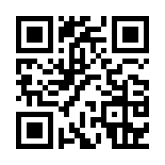

# QRコード読み取りアプリ
## デプロイ方法
### 前提条件
以下のツールが必要です。
- SAM CLI
- Java 8 以上
- Maven

### デプロイ手順
```
sam build
sam deploy --guided
```

## 動作確認
```
$ curl -X POST -H 'Content-type: image/png' --data-binary "@QR_510236.png" <QRdecodeEndpoint>/
```

### 動作デモ
https://m28dev.github.io/qrdecoder/

### 確認用QRコード

